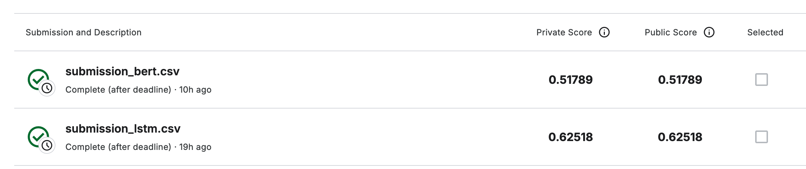

# Sentiment Analysis Project

This project explores sentiment analysis using classical machine learning algorithms, Long Short-Term Memory (LSTM) networks, and BERT-based transfer learning. The dataset used is from Rotten Tomatoes movie reviews, where the task is to predict the sentiment of phrases. The sentiment labels are categorized into five classes: negative, somewhat negative, neutral, somewhat positive, and positive.

## Models Used

### 1. **Classical Machine Learning Models**:

I implemented and tested multiple classical machine learning algorithms, such as:

- Logistic Regression
- Support Vector Machines (SVM)
- Random Forest
- Gradient Boosting
- XGBoost

However, the accuracy scores from these models were lower than expected. Hence, I decided not to submit them for final evaluation. The performance of these models may be improved with further feature engineering or hyperparameter tuning, but they were outperformed by the deep learning approaches in this project.

### 2. **LSTM Model**:

An LSTM model was developed to handle the sequential nature of the textual data. The model includes:

- An Embedding layer for word representations.
- Two LSTM layers with 128 and 64 units, respectively, for capturing long-range dependencies.
- A Dense layer for classification.

This model achieved a **public score of 0.62518** on the competition leaderboard, as shown in the image below.

### 3. **BERT (Transfer Learning)**:

I leveraged the pre-trained BERT (Bidirectional Encoder Representations from Transformers) model for transfer learning. BERT's ability to capture deep contextualized word representations provided an excellent foundation for sentiment classification. Despite the power of BERT, the model achieved a **public score of 0.51789**, which was lower than the LSTM model.

### Scores Comparison:

| Model | Public Score | Private Score |
| ----- | ------------ | ------------- |
| LSTM  | **0.62518**  | **0.62518**   |
| BERT  | 0.51789      | 0.51789       |

The image below shows the results from the Kaggle competition submissions:

## Conclusion

Although BERT is known for its strong performance in NLP tasks, in this particular case, the LSTM model outperformed BERT in sentiment classification on the Rotten Tomatoes dataset. This could be due to a variety of factors such as limited data, preprocessing, or hyperparameters, and further tuning might improve the BERT model's performance.

## Future Work

To further enhance the performance of the models, the following steps could be considered:

- Hyperparameter tuning for both LSTM and BERT models.
- Experimenting with different word embeddings such as GloVe or FastText.
- Fine-tuning the BERT model more extensively with the specific dataset.
- Applying more sophisticated pre-processing techniques for the text data.
